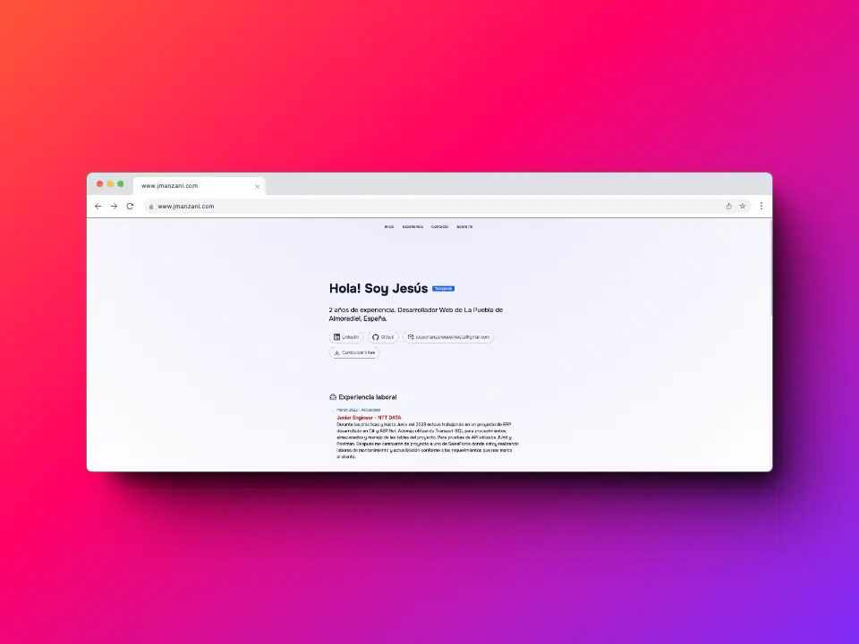
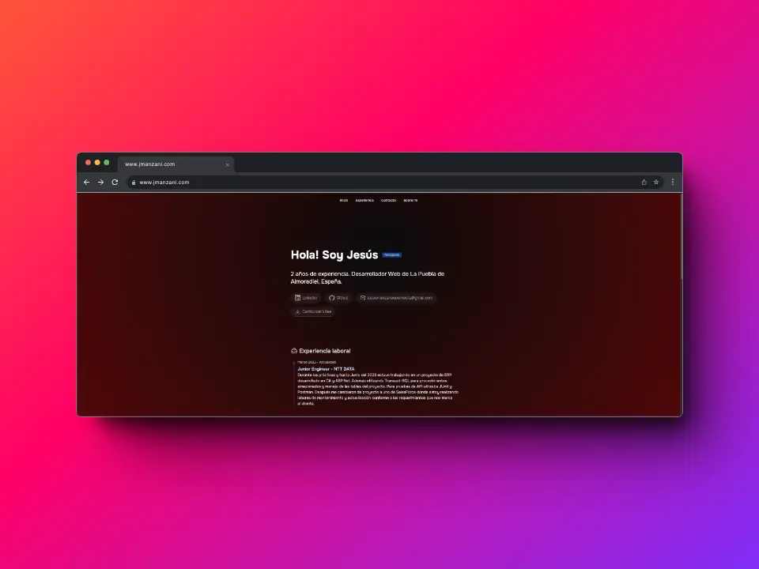

# Portafolio Personal con Next.js

Este es mi portafolio personal desarrollado con Next.js, una aplicación web moderna para mostrar mis habilidades, proyectos y experiencia.

## Descripción

Este proyecto es un portafolio web diseñado para destacar mis habilidades como desarrollador y mostrar los proyectos en los que he trabajado.

## Características

- Diseño moderno y responsivo.
- Secciones para mostrar información personal, habilidades, proyectos y contacto.
- Integración de datos dinámicos para una fácil actualización del contenido.

## Capturas de Pantalla

## Tecnologías Utilizadas

- **Next.js**: Para la construcción de la aplicación web.
- **React**: Para la creación de componentes reutilizables.
- **Tailwind**: Para estilos más dinamicos.
- **Docker**: Para despliegue y hosting.

## Instalación y Uso

1. Clona este repositorio: `git clone https://github.com/jmanzani/porfolio-next.git`
2. Instala las dependencias: `pnpm install`
3. Inicia el servidor de desarrollo: `pnpm run dev`
4. Abre tu navegador y ve a `http://localhost:3000`

## Licencia

Este proyecto está bajo la licencia GPL. Para más detalles, consulta el archivo `LICENSE`.

## Contacto

- Email:  contacto@jmanzani.com